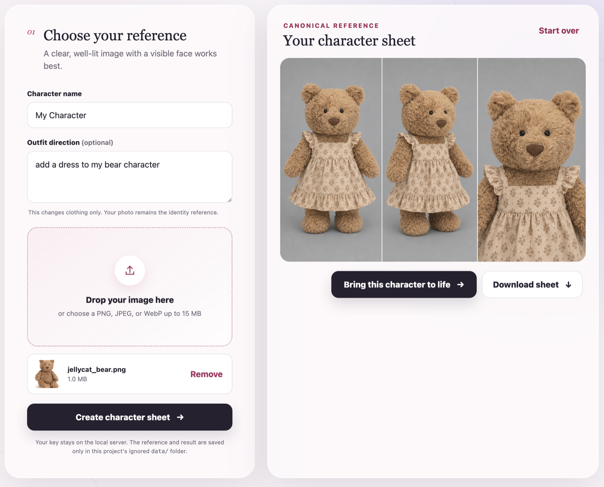
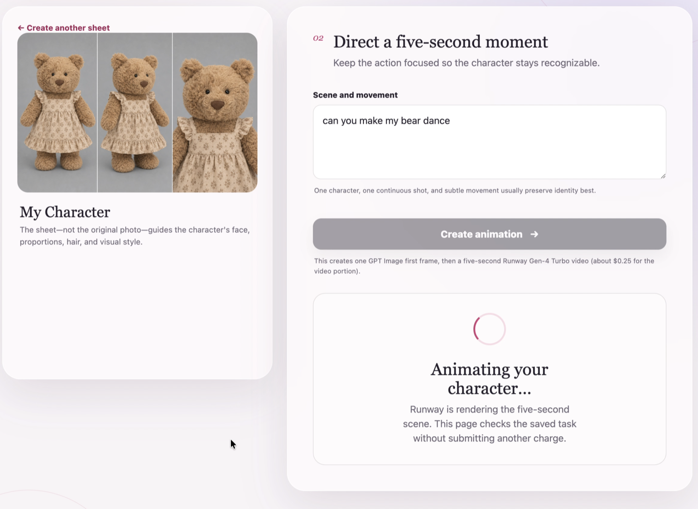
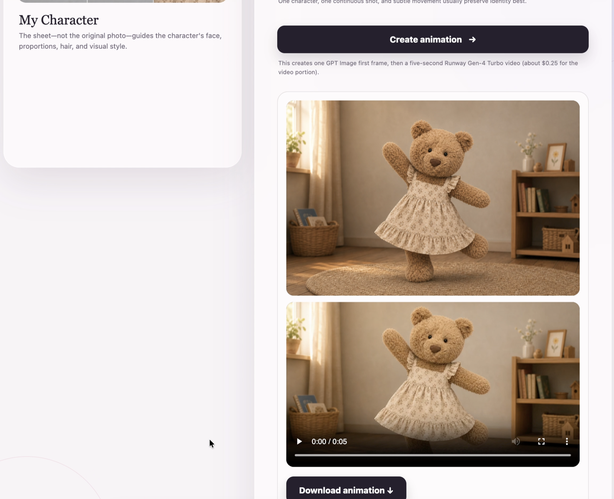
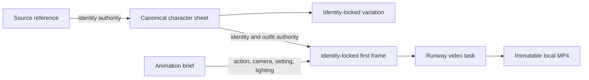

# Character Consistency Toolkit

An open-source experimentation toolkit for preserving character identity across generative image and video workflows.

The toolkit converts a source reference into an immutable canonical character sheet. That sheet becomes the visual authority for downstream OpenAI image generation and Runway animation, with versioned prompts, ordered references, and traceable provenance for every result.

```text
Source Reference
      ↓
Canonical Character Sheet
      ↓
Identity-Locked Image
      ↓
Animation First Frame
      ↓
Generated Video
```

## Example

### 1. Create a canonical character sheet

Upload one source reference and optionally direct the outfit. The generated three-panel sheet becomes the character's visual source of truth.



### 2. Direct a short moment

The animation workspace keeps the canonical sheet visible while the creator describes the action, setting, and camera direction.



### 3. Review the generated animation

The completed first frame and locally persisted video remain linked to the same canonical character.



## Why this exists

Generative models can create an appealing character once while changing the face, proportions, hair, clothing, or visual medium in the next shot. Text prompts alone do not provide a stable identity anchor, and multiple references become ambiguous without explicit precedence.

This project treats character consistency as a system-design problem: define a canonical identity, control which inputs may change it, and preserve enough lineage to explain every generated asset.

## System design



The governing rules are:

- **Canonical identity:** downstream generation uses the canonical sheet rather than repeatedly interpreting the original source.
- **Ordered authority:** every image reference has an explicit role and precedence. An optional supporting photo supplies secondary facial evidence only.
- **Character invariant:** for animation, the canonical sheet controls identity, proportions, hair, visual medium, and outfit. The animation brief may control action, expression, setting, lighting, environmental movement, camera, and pose.
- **Traceable generation:** assets retain exact rendered prompts and prompt hashes, ordered reference hashes, provider/model metadata, parameters, request IDs, timestamps, and usage when returned.
- **Provider separation:** OpenAI GPT Image 2 creates sheets, variations, and first frames; Runway Gen-4 Turbo creates video through a separate server-side adapter.
- **Safe experimentation:** automated tests inject fake providers and never make paid API calls.

## Capabilities

- Photo-to-canonical-sheet generation through a local website
- Approved-character and optional supporting-photo generation through the CLI
- Identity-locked variation generation through the CLI
- Five-second animation generation and download
- Persisted Runway task state with resumable status polling
- Immutable local image/video storage and SHA-256 asset hashes
- Versioned Markdown prompts and complete generation provenance
- Permanent deletion of a character and all locally owned assets
- Dependency-free Node.js application with fake-provider tests

## Quick start

### Requirements

- Node.js 22 or newer
- An OpenAI API key with GPT Image access
- A Runway API key for animation; sheet generation works without it

Create the local environment file:

```bash
cp .env.example .env
```

Add your keys and configuration:

```dotenv
OPENAI_API_KEY=your_key_here
OPENAI_IMAGE_MODEL=gpt-image-2-2026-04-21
OPENAI_IMAGE_QUALITY=medium
RUNWAYML_API_SECRET=your_runway_key_here
RUNWAYML_VIDEO_MODEL=gen4_turbo
CHARACTER_LAB_DATA_DIR=./data
PORT=4173
```

Start the local website:

```bash
npm run dev
```

Open [http://127.0.0.1:4173](http://127.0.0.1:4173). Restart the server after changing `.env`.

The image workflow uses OpenAI's Image API edits endpoint to generate from ordered references. See the [image generation guide](https://developers.openai.com/api/docs/guides/image-generation), [GPT Image 2 model page](https://developers.openai.com/api/docs/models/gpt-image-2), and [Runway API guide](https://docs.dev.runwayml.com/guides/using-the-api/).

## Website workflow

1. Enter an optional character name and outfit direction.
2. Drop in one clear PNG, JPEG, or WebP source photo.
3. Create, review, and download the three-panel canonical sheet.
4. Select **Bring this character to life**.
5. Describe a short moment, then review and download the five-second animation.

The source photo controls identity, hair, apparent age, body profile, and proportions. Optional sheet-generation text controls clothing, footwear, and wearable accessories only.

Animation uses two stages:

```text
Canonical sheet
-> GPT Image 16:9 first frame
-> Runway Gen-4 Turbo video task
-> Local MP4
```

The canonical sheet is the sole identity and wardrobe authority. Conflicting outfit instructions in an animation brief are ignored. Once a Runway task ID is persisted, reopening the animation workspace resumes status checks instead of submitting another paid task. Completed videos are downloaded locally because provider output URLs expire. See Runway's [pricing documentation](https://docs.dev.runwayml.com/guides/pricing/).

## CLI

Create a character from an approved image, optionally with a supporting photo:

```bash
node --env-file=.env src/cli.mjs create \
  --name "Mina" \
  --approved "/absolute/path/to/approved-character.png" \
  --supporting-photo "/absolute/path/to/source-photo.jpg"
```

The approved image remains authoritative for identity, medium, proportions, styling, hair, and outfit. The optional photo provides secondary facial evidence only.

Create a variation:

```bash
node --env-file=.env src/cli.mjs vary \
  --character "character-..." \
  --brief "A winter explorer edition in a red technical coat, standing in snow."
```

Inspect or permanently delete local records:

```bash
node src/cli.mjs list
node src/cli.mjs show --character "character-..."
node src/cli.mjs delete --character "character-..." --yes
```

Omit `--supporting-photo` when creating from only an approved character image.

## Reproducibility and safety

The toolkit targets experimental reproducibility rather than pixel-identical output from nondeterministic models.

- Prompts are immutable, versioned Markdown files.
- Generated assets are never overwritten.
- Asset and prompt SHA-256 hashes detect byte-level changes.
- Manifest updates are atomic, and orphaned outputs are removed after commit failures.
- Unknown billable request outcomes are recorded and are not automatically retried.
- API keys remain in the local Node.js process and never enter browser code.
- The server binds only to `127.0.0.1`; `.env` and generated `data/` are Git-ignored.

Character data is stored under:

```text
data/characters/<character-id>/
├── manifest.json
└── assets/
    ├── sources/
    ├── canonical/canonical-sheet.png
    ├── variations/
    └── animations/<animation-id>/
        ├── first-frame.png
        └── animation.mp4
```

## Validation

```bash
npm run check
```

This runs syntax checks and Node.js tests. Pull requests and pushes to `main` run the same checks on Node.js 22 in GitHub Actions. Tests never call live image or video providers.

## Current scope

- One trusted local user and one writer at a time
- Synchronous image and first-frame generation
- Human identity review rather than automated scoring
- No public hosting, accounts, database, background workers, cloud storage, biometric identification, or silent provider fallback

Closing the page does not cancel an in-flight provider request. Billable operations with unknown outcomes require manual review rather than automatic retry.

## Design documentation

- [Architecture](docs/architecture.md): modules, data flow, reference precedence, and persistence
- [Development design](docs/dev-design.md): invariants, security decisions, provenance, and failure semantics
- [Product roadmap](docs/roadmap.md): completed milestones and future experiments
