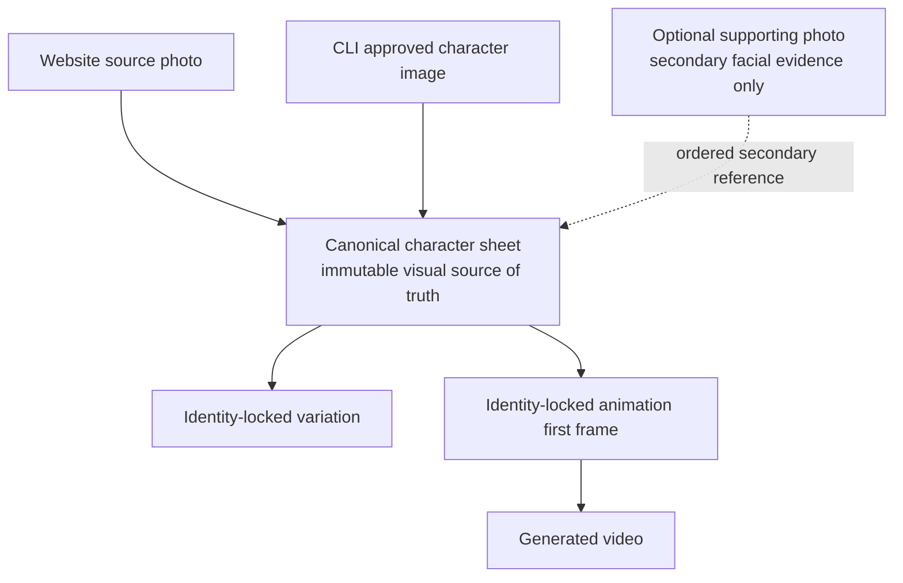
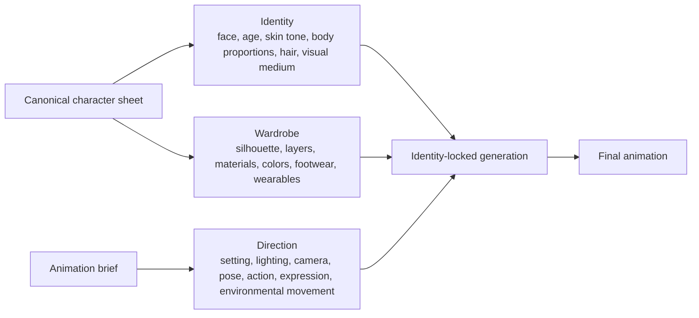
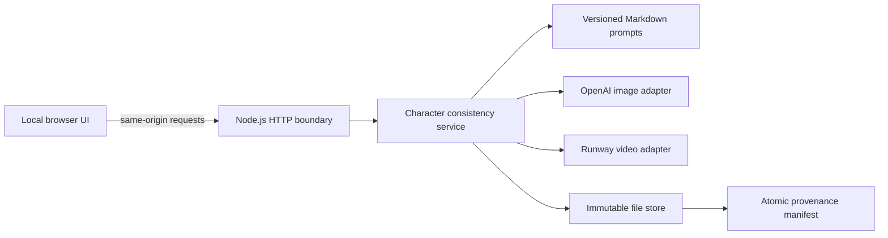

# Character Consistency Toolkit

An open-source experimentation toolkit for preserving character identity across generative image and video workflows.

The system turns a primary visual reference into an immutable, canonical three-panel character sheet. That sheet becomes the visual source of truth for identity-locked variations, animation first frames, and generated video. The work extends beyond prompt engineering: the toolkit defines reference authority, enforces generation invariants, separates providers, and records the lineage of every generated asset.

```text
Source Reference
      ↓
Canonical Character Sheet
      ↓
Identity-Locked Generation
      ↓
Animation First Frame
      ↓
Generated Video
```

## Demo

Public demo media is not yet committed to this repository. This placeholder identifies the sanitized assets needed for a complete visual walkthrough without presenting generated examples as real project output:

```text
docs/assets/demo/source-reference.jpg
        ↓
docs/assets/demo/canonical-character-sheet.png
        ↓
docs/assets/demo/identity-locked-shot.png
        ↓
docs/assets/demo/identity-locked-animation.mp4
```

The local application displays and downloads real generated sheets and animations. Files under the Git-ignored `data/` directory are private working assets and are intentionally not embedded here.

## The problem

Generative models can produce an appealing character once while changing the face, proportions, hair, clothing, or visual medium in the next image or video. Words alone do not provide a stable identity anchor, and multiple reference images become ambiguous when their authority is not explicit.

This toolkit explores a systems question: how can a character remain recognizable across models, shots, poses, environments, and animation while each result remains traceable to the inputs and generation strategy that produced it?

## How it works

The two entry paths use different source terminology:

- **Website:** a **source photo** is the primary reference. It controls identity, hair, apparent age, body profile, and proportions. Optional text controls clothing, footwear, and wearable accessories only.
- **CLI:** an **approved character image** is the primary reference. An optional **supporting photo** may provide secondary facial evidence, but cannot replace the approved character's medium, proportions, styling, outfit, or hair treatment.

Both paths produce an immutable **canonical character sheet**. Downstream work uses the sheet—not the original source—as its visual authority:



## Design principles

### Canonical identity

The canonical sheet is the stable visual representation used by downstream generations. Returning to the original source for every new asset would allow the character's medium and construction to drift over time.

### Ordered visual authority

References are ordered and assigned explicit roles. A primary approved image and a secondary supporting photo are not treated as an interchangeable image collection; their precedence is part of the recorded generation request.

### Generation provenance

Each generated result records the exact rendered prompt and prompt SHA-256, ordered reference roles and asset hashes, provider, model, parameters, provider request ID, timestamps, and provider usage when returned. Prompt revisions are append-only after use so historical behavior remains explainable.

### Provider-separated pipeline

Image generation and video generation are separate stages behind server-side provider adapters. OpenAI GPT Image 2 creates sheets, variations, and animation first frames; Runway Gen-4 Turbo creates video from a first frame.

### Safe experimentation

Automated tests inject fake providers and never make live, paid API calls. The real provider adapters are tested with controlled HTTP responses for request construction, provenance, timeout, and error behavior.

## Character invariant

For animation, the canonical sheet controls both character identity and wardrobe. The creator's animation brief can direct the shot, but cannot redesign the character.



If an animation brief conflicts with the canonical outfit, the canonical sheet wins. The first-frame prompt and the video-motion prompt both enforce this constraint.

## Architecture



- `web/` owns local interaction, progress, preview, and download behavior.
- `src/web-app.mjs` validates HTTP input, verifies image types, maps safe public errors, and serves immutable assets.
- `src/service.mjs` owns workflow, authority rules, reference ordering, provenance assembly, and failure cleanup.
- `src/prompt.mjs` and `prompts/` own versioned prompt rendering and hashes.
- `src/openai-image-provider.mjs` and `src/runway-video-provider.mjs` isolate provider-specific transport and errors.
- `src/store.mjs` owns safe paths, immutable writes, atomic manifest replacement, and permanent deletion.

## Capabilities

- Local character records and immutable image/video storage
- Photo-to-canonical-sheet generation in the local website
- Approved-character and optional supporting-photo generation through the CLI
- Identity-locked variation generation through the CLI
- Explicit ordered-reference hierarchy
- Versioned Markdown prompts with rendered prompt hashes
- Exact generation provenance and asset SHA-256 hashes
- Five-second animation generation and download through the linked animation workspace
- Persisted Runway task state and resumable status polling
- Permanent deletion of a character and all locally owned source and generated assets
- Dependency-free Node.js web application and CLI
- Fake-provider tests with no paid API calls

## Requirements

- Node.js 22 or newer
- An OpenAI API key with GPT Image access
- A Runway API key for animation; character-sheet generation works without it

The image workflow uses the Image API's edits endpoint because it generates from ordered image references. See OpenAI's [image generation guide](https://developers.openai.com/api/docs/guides/image-generation), the [GPT Image 2 model page](https://developers.openai.com/api/docs/models/gpt-image-2), and Runway's [API guide](https://docs.dev.runwayml.com/guides/using-the-api/).

## Setup

```bash
cp .env.example .env
```

Add your keys and configuration to `.env`:

```dotenv
OPENAI_API_KEY=your_key_here
OPENAI_IMAGE_MODEL=gpt-image-2-2026-04-21
OPENAI_IMAGE_QUALITY=medium
RUNWAYML_API_SECRET=your_runway_key_here
RUNWAYML_VIDEO_MODEL=gen4_turbo
CHARACTER_LAB_DATA_DIR=./data
PORT=4173
```

Only `OPENAI_API_KEY` is required for character-sheet generation. `RUNWAYML_API_SECRET` is additionally required for animation. Restart the local server after changing `.env`.

## Use the local website

Start the localhost server:

```bash
npm run dev
```

Then open [http://127.0.0.1:4173](http://127.0.0.1:4173):

1. Enter an optional character name.
2. Optionally describe the character's clothing, footwear, and wearable accessories.
3. Drop in one clear PNG, JPEG, or WebP source photo.
4. Select **Create character sheet**.
5. Keep the page open while GPT Image creates the three coordinated views.
6. Review and download the canonical sheet.
7. Select **Bring this character to life** to open the animation workspace.

## Animation workflow

```text
Canonical character sheet
-> GPT Image identity-locked 16:9 first frame
-> Runway Gen-4 Turbo five-second video task
-> Immutable local MP4
```

Describe one short moment in the animation workspace. The brief may control the environment and performance described in [Character invariant](#character-invariant), while the canonical identity and outfit remain fixed.

Runway processing is asynchronous. Once a task ID is persisted, reopening the animation workspace resumes status checks rather than submitting another paid task. On success, the server downloads the MP4 into immutable local storage because provider output URLs expire. Current Runway pricing is available in the provider's [pricing documentation](https://docs.dev.runwayml.com/guides/pricing/).

## Use the CLI

Create a character from an approved character image:

```bash
node --env-file=.env src/cli.mjs create \
  --name "Mina" \
  --approved "/absolute/path/to/approved-character.png"
```

Optionally add the original photo as secondary facial evidence:

```bash
node --env-file=.env src/cli.mjs create \
  --name "Mina" \
  --approved "/absolute/path/to/approved-character.png" \
  --supporting-photo "/absolute/path/to/source-photo.jpg"
```

The approved character remains authoritative for visual medium, proportions, styling, hair treatment, outfit, and overall identity. The supporting photo cannot replace it.

Create an identity-locked variation:

```bash
node --env-file=.env src/cli.mjs vary \
  --character "character-..." \
  --brief "A winter explorer edition in a red technical coat, standing in snow."
```

Inspect local records:

```bash
node src/cli.mjs list
node src/cli.mjs show --character "character-..."
```

Permanently delete a character and every locally stored source and generated asset:

```bash
node src/cli.mjs delete --character "character-..." --yes
```

## Reproducibility and persistence

The toolkit targets **experimental reproducibility**, not pixel-identical regeneration from a nondeterministic model. Its manifest retains the conditions needed to explain and compare a result after prompts, code, or providers change:

- exact rendered prompt, immutable prompt revision, and prompt SHA-256;
- ordered reference roles, MIME types, and SHA-256 hashes;
- output asset paths, MIME types, byte counts, and SHA-256 hashes;
- provider, model, request ID, parameters, timestamps, and usage when available.

Local data uses this structure:

```text
data/characters/<character-id>/
├── manifest.json
└── assets/
    ├── sources/
    ├── canonical/canonical-sheet.png
    ├── variations/<variation-id>.png
    └── animations/<animation-id>/
        ├── first-frame.png
        └── animation.mp4
```

Assets are written without overwrite, and the manifest is replaced atomically. If canonical generation fails, staged character data is removed. If a generated variation or completed video cannot be committed to its manifest, the orphaned output is removed. Provider requests with an unknown billing outcome are not automatically retried.

The website binds only to `127.0.0.1`. API keys remain in the Node.js process and are never sent to browser code. The `.env` file and generated `data/` directory are Git-ignored.

## Validation

This project has no third-party runtime or test dependencies.

```bash
npm run check
```

The command runs syntax checks and Node.js tests. Pull requests and pushes to `main` run the same checks on Node.js 22 in GitHub Actions. Automated tests never call a live image or video provider.

## Current scope and limitations

- The toolkit assumes one trusted local user and one writer at a time.
- Image generation is synchronous and may take several minutes.
- Animation waits synchronously for its first frame; the Runway video task is asynchronous and can resume status checks after its task ID is stored.
- Closing or refreshing the page does not cancel an in-flight provider request.
- Billable requests with unknown outcomes are not retried automatically.
- Evaluation is human review rather than an automated identity score.
- Prompt effectiveness still requires testing across varied character styles, ages, body types, and presentation.
- Character consistency means visual continuity, not face recognition or biometric identification.

Current non-goals include public hosting, user accounts, a database, concurrent background workers, cloud object storage, automatic retries, automated biometric evaluation, and a dependency on Floney's Doll Factory.

## Design documentation

- [Architecture](docs/architecture.md) describes the modules, generation flow, reference precedence, and persistence model.
- [Development design](docs/dev-design.md) documents governing invariants, system diagrams, security decisions, reproducibility strategy, failure semantics, and production gates.
- [Product roadmap](docs/roadmap.md) records completed milestones and future experiments.
