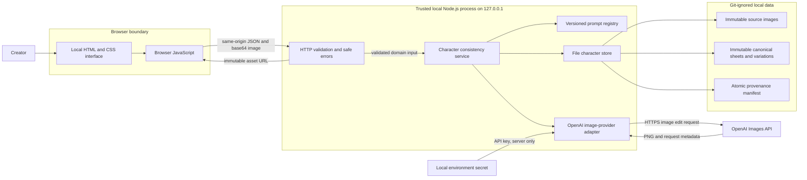
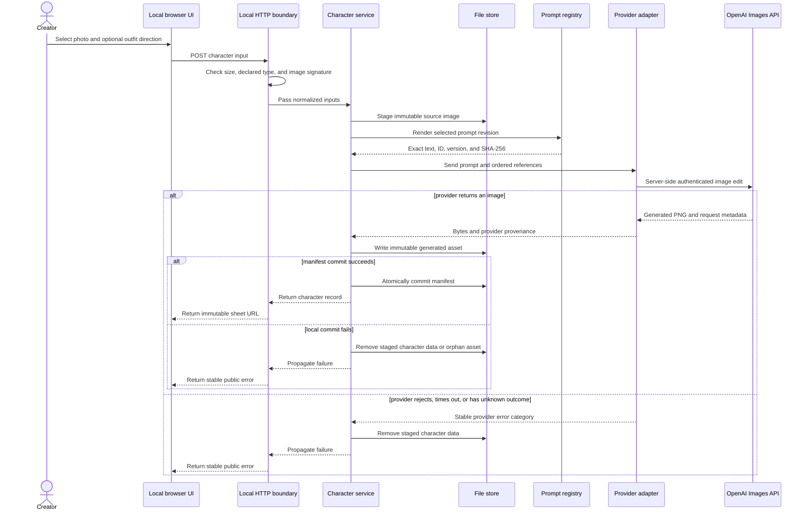
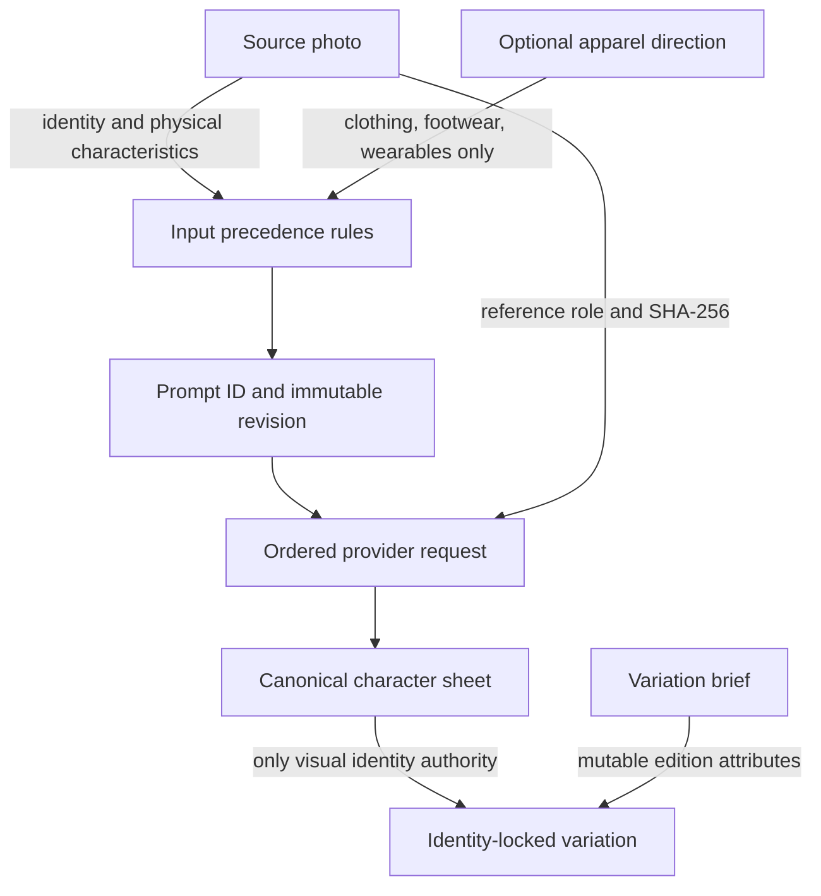
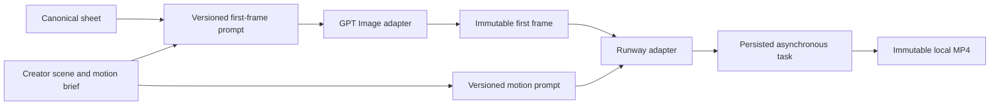

# Development Design: Character Consistency Toolkit

## Status and purpose

This document describes the current local-first architecture and the design decisions that make it secure, inspectable, and reproducible. It is a development design for contributors, not a claim that the toolkit is already a public multi-user service.

The system turns one visual identity reference and optional controlled text into a canonical character sheet. That sheet becomes the visual authority for later variations. The difficult engineering problem is therefore not only image generation; it is preserving authority and lineage as nondeterministic AI behavior evolves.

## System drivers

The architecture is optimized for these priorities, in order:

1. **Identity authority:** every downstream image must have an explicit visual source of truth.
2. **Reproducibility:** a result must remain traceable to exact inputs, prompt revision, references, provider, model, and parameters.
3. **Security by boundary:** secrets and provider-specific behavior stay outside the browser.
4. **Failure integrity:** the filesystem must not retain untracked or partially committed generations.
5. **Small-system clarity:** a personal research tool should remain understandable without premature database, queue, or cloud infrastructure.
6. **Replaceable edges:** UI, persistence, and image-provider implementations may evolve without moving product rules out of the domain service.

## Governing invariants

These rules are more important than any individual module:

- A canonical sheet is an immutable identity anchor, not a mutable working file.
- The role and order of every image reference are explicit.
- The photo controls identity and physical presentation; optional text may control apparel only.
- A prompt revision is append-only after use. Behavioral changes create a new revision.
- A generated asset is valid only when its provenance record is committed.
- Provider credentials never cross the server/browser boundary.
- Provider or prompt fallback is never silent.
- Character consistency means visual continuity, not biometric identification.

## Overall system



### Module ownership

| Module | Owns | Must not own |
| --- | --- | --- |
| `web/` | Interaction, local preview, progress, download | Secrets, prompt construction, provider calls |
| `src/web-app.mjs` | HTTP limits, MIME verification, safe public errors | Identity precedence or provider-specific request bodies |
| `src/service.mjs` | Workflow, reference order, authority, provenance assembly, rollback | Browser rendering or OpenAI transport details |
| `src/prompt.mjs` and `prompts/` | Prompt selection, rendering, versions, prompt hashes | Image persistence or HTTP behavior |
| `src/openai-image-provider.mjs` | OpenAI request translation, timeout, provider errors, response provenance | Product identity rules or local manifests |
| `src/store.mjs` | Safe paths, immutable writes, atomic manifests, deletion | Prompt semantics or provider behavior |

## Generation transaction



The provider request itself cannot be made transactional: a network failure can leave its billing outcome unknown. The system therefore does not automatically retry unknown outcomes. Local state, however, is transactional at the workflow level: either the asset and provenance are both committed, or staged data is removed.

## Authority and lineage



This precedence prevents two common failure modes:

- **Prompt conflict:** text cannot silently replace the visual identity supplied by the photo.
- **Reference drift:** later variations use the canonical sheet rather than repeatedly returning to the original photo and changing visual medium over time.

## Persistence model

```text
data/characters/<character-id>/
├── manifest.json
└── assets/
    ├── sources/
    │   ├── source-photo.<ext>
    │   ├── approved-character.<ext>
    │   └── supporting-photo.<ext>
    ├── canonical/
    │   └── canonical-sheet.png
    └── variations/
        └── <variation-id>.png
```

The manifest is the index and provenance record. It contains the character ID, normalized creator inputs, asset paths and hashes, exact rendered prompt and hash, ordered reference roles and hashes, provider, model, parameters, request ID, timestamps, and provider usage when available.

The file store was chosen over a database because the current product has one local writer, modest data volume, and a strong need for inspectability and portability. This is a deliberate scope decision, not a claim that filesystem persistence supports concurrent public traffic.

## Three primary security decisions

| Decision | Threats addressed | Current mechanism | Limitation |
| --- | --- | --- | --- |
| **Keep credentials and provider access inside the trusted server boundary** | API-key theft, browser-bundle exposure, and unintended client-side provider calls | `OPENAI_API_KEY` is read only by `src/server.mjs`; the server binds to `127.0.0.1`; the UI uses a same-origin API; CSP restricts browser scripts and connections | The local machine still protects `.env`; a public deployment requires managed secrets, HTTPS, authentication, authorization, and CSRF review |
| **Treat every browser value and filesystem path as untrusted input** | Oversized payloads, malformed images, path traversal, arbitrary file access, and invalid domain state | JSON and image byte limits, PNG/JPEG/WebP signature detection, centralized text validation, validated IDs, and confined relative asset paths | Content scanning is outside the trusted localhost scope and must be reassessed before accepting public uploads |
| **Fail without leaking or corrupting state** | Provider-detail exposure, orphaned assets, silent history changes, and duplicate billable retries after uncertain outcomes | Stable public error categories, exclusive immutable asset writes, transactional cleanup, atomic manifest replacement, provider timeout, and no automatic retry for `outcome-unknown` | Detailed provider diagnostics and billing reconciliation remain manual; local immutability is not write-once storage |

Sensitive-trait inference is also prohibited at the product-policy layer: prompts do not label demographic traits, and the toolkit implements neither face recognition nor biometric scoring.

The current security boundary is intentionally narrow: one trusted person on one machine. Publishing this server without authentication, authorization, rate limits, HTTPS, and durable secret management would violate the design.

## Preservability and reproducibility decisions

“Preservability” means retaining enough evidence to understand and compare an AI result after code, prompts, or models change.

| Decision | Why it matters |
| --- | --- |
| Append-only prompt revisions | `v1`, `v2`, and `v3` preserve historical behavior instead of rewriting it. The convention is enforced through review and provenance, not filesystem permissions. |
| Exact rendered prompt storage | Template files alone are insufficient because character names and creator inputs change the final request. |
| Prompt SHA-256 | Detects any byte-level change to the rendered prompt and provides a compact identity for comparisons. |
| Source and output SHA-256 | Proves which exact files participated in a generation and detects replacement or corruption. It is not encryption or visual similarity scoring. |
| Ordered reference roles | Prevents the same images in a different order from being treated as an equivalent experiment. |
| Provider and model capture | Separates prompt regressions from provider or model changes. |
| Parameter and request-ID capture | Preserves resolution, quality, reference count, and a provider-side correlation handle. |
| Immutable generated assets | Historical outputs remain comparable; regeneration creates a new asset rather than mutating evidence. |
| Atomic manifest replacement | Readers see the previous complete state or the next complete state, not a partially written JSON document. |
| No silent fallback | A failed provider or prompt revision remains a failure instead of producing an untraceable result through another path. |

The goal is **experimental reproducibility**, not pixel-identical regeneration. Image models can remain nondeterministic even when all recorded inputs are the same. The manifest preserves the conditions of the experiment so results can be explained and compared honestly.

## Failure semantics

| Failure point | Required behavior |
| --- | --- |
| Invalid input | Reject before creating provider work |
| Provider rejects input | Return a stable category; do not expose the provider body |
| Provider times out or network outcome is unknown | Do not retry automatically because a duplicate could be billed |
| Canonical generation fails | Delete the staged character directory |
| Variation asset writes but manifest commit fails | Delete the orphan variation asset |
| Existing immutable path is reused | Fail rather than overwrite |
| Character deletion is requested | Delete the character directory and all owned assets explicitly |

## Evolution boundaries

The current interfaces provide natural replacement points:

- A second provider can implement the image-provider contract without changing authority rules.
- Cloud object storage can replace `FileCharacterStore` while preserving immutable asset semantics and hashes.
- A database can index manifests when concurrent writers or querying justify it.
- A durable job system can wrap service operations when generation must survive page closure or process restarts.
- Automated evaluations can attach scores to existing assets without changing their provenance.

These are extension paths, not current scaffolding. The project should add them only when a measured requirement appears.

## Approved animation extension

Milestone 0.4 adds cinematic image-to-video as a derived-asset workflow. The canonical sheet remains the identity authority, but it is not itself a suitable first frame because it contains three figures in one horizontal composition. The service therefore derives one immutable landscape first frame from the sheet before starting a video task.

The sheet also owns wardrobe continuity. Creator animation text is subordinate and may direct setting, lighting, camera, pose, action, expression, and environmental movement only. It cannot replace, restyle, recolor, add, or remove the canonical outfit or wearable accessories. Both the first-frame and motion prompt enforce this rule so wardrobe cannot drift at either provider boundary.



Runway output URLs are temporary and are never treated as stored assets. On success, the server downloads the MP4, verifies the response, stores it under the owning character, records its hash and provider provenance, and only then returns a local immutable URL. A task timeout or lost client connection does not imply cancellation and must not trigger an automatic retry.

## Public-production gates

Before exposing the toolkit to multiple users, the design requires a separate milestone covering:

- authentication and per-user authorization;
- durable database and object storage;
- persisted asynchronous generation jobs and idempotency keys;
- quotas, rate limits, and cost controls;
- HTTPS, managed secrets, and deployment isolation;
- privacy, consent, retention, export, and deletion policies;
- operational logs, metrics, alerting, and provider reconciliation;
- browser-level end-to-end tests and accessibility validation.

Until those gates are met, the supported deployment remains a personal localhost research environment.
